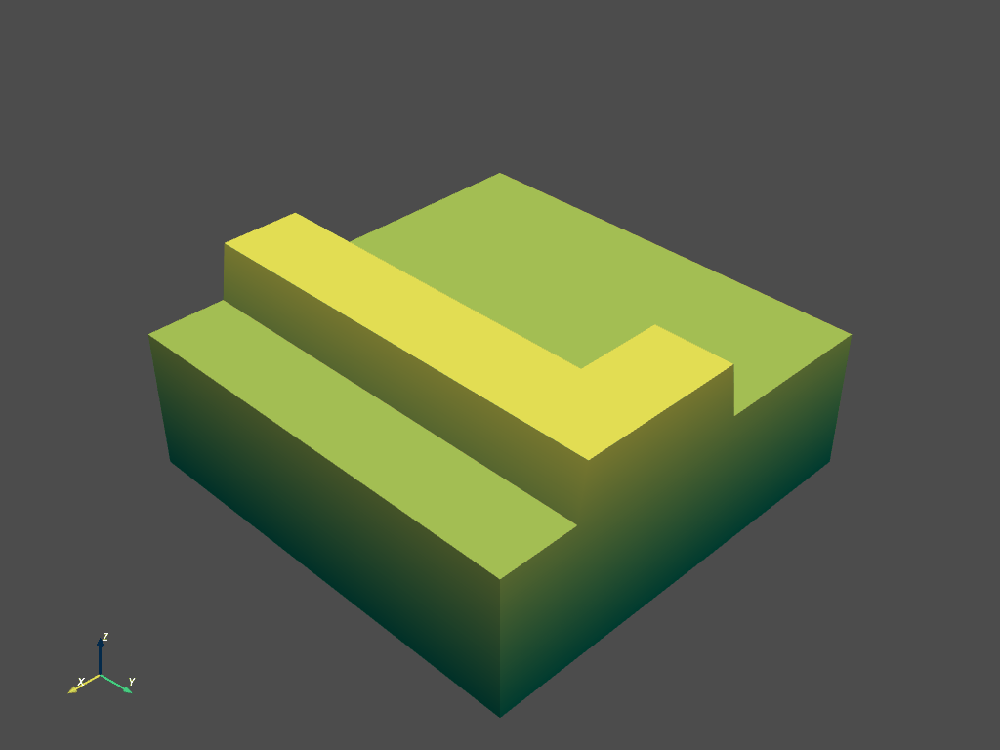

# XLand-like environment

Procedurally generated environments inspired by [XLand](https://arxiv.org/abs/2107.12808) from Deepmind.



For now, we are building the procedural generation using [Wave Function Collapse](https://github.com/mxgmn/WaveFunctionCollapse) (WFC), and we use an external dependency called [fast-wfc](https://github.com/math-fehr/fast-wfc), which contains a really fast implementation of WFC in C++.

## Installation

First, install the Wave Function Collapse C++ library:

```
git clone https://github.com/math-fehr/fast-wfc && cd fast-wfc && cmake . && make install
```

Then create a virtual env, activate it, and then install `simenv`:

```
cd .. && git clone https://github.com/huggingface/simenv.git
cd simenv
pip install -e ".[dev]"
```

Then install the `xland` package:

```
cd environments/xland
pip install -e ".[dev]"
```

### Style

Before you merge a PR, fix the style (we use `isort` + `black`)
```
make style
```

## Basic Usage

A minimalistic example to generate from an example map:

```
from xland import gen_setup, generate_env
from xland.utils import create_2d_map

# Generate initial tiles and structure to save maps and etc
gen_setup()

# Create example map from csv file on examples
create_2d_map(name="example_map_01")

# Sample from example map and show interactive mode
generate_env(width=8, height=8, sample_from="example_map_01", show=True)
```

Other scripts might be found in the folder `scripts`. The map that is used as example is in CSV format for human readability inside the `benchmark/examples`.