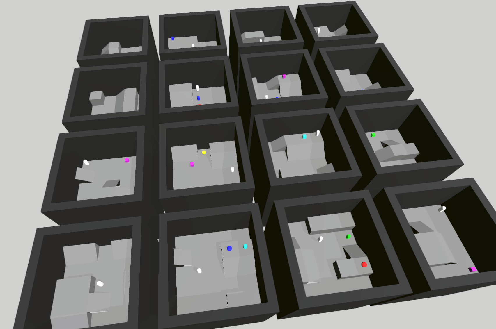

# XLand-like environment

Procedurally generated environments inspired by [XLand](https://arxiv.org/abs/2107.12808) from Deepmind.



We use the procedural generation implemented in `simulate` using [Wave Function Collapse](https://github.com/mxgmn/WaveFunctionCollapse) (WFC), and the C++ code there is mainly based on the implementation [fast-wfc](https://github.com/math-fehr/fast-wfc), which contains a really fast implementation of WFC in C++.

## Installation

First, ensure that you have a C++ compiler installed, since we will be using Cython to speed up things.

Then create a virtual env, activate it, and then install `simulate`:

```
cd .. && git clone https://github.com/huggingface/simulate.git
cd simulate
pip install -e ".[dev]"
```

Then install the `xland` package:

```
cd environments/xland
pip install -e ".[dev]"
```

And it's done!

### Style

Before you merge a PR, fix the style (we use `isort` + `black`)
```
make style
```

## Basic Usage

Here is a minimalistic example to generate from an example map (run from `simulate/environments/xland`):

```
from xland import create_scene
import numpy as np

# Read example map
example_map = np.load("benchmark/examples/example_map_01.npy")

# Sample from example map
# You can add the argument 'engine="unity"' if you want to run it on Unity
# create_scene returns the scene, and if it fails, it returns None
scene = create_scene(width=8, height=8, sample_map=example_map)

# Show scene
scene.show()
```

Other scripts might be found in the folder `scripts`. 
The easiest script to see results from is `random_agent`, which is configured to run with Unity. 
To run this, run:
`python scripts/random_agent.py --build_exe=$build_dir`
An example `build_dir` on Mac is: `/Users/nato/Downloads/unity-app.app/Contents/MacOS/Simulate`.